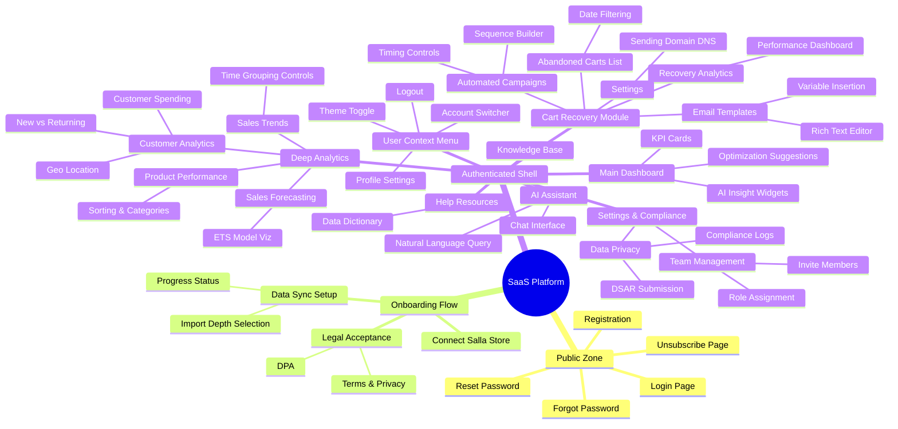

{
  "diagram_info": {
    "diagram_name": "Application Navigation & Site Map",
    "diagram_type": "mindmap",
    "purpose": "To visualize the hierarchical structure of the SaaS application, defining the navigation paths, module organization, and accessible routes for authenticated and unauthenticated users.",
    "target_audience": [
      "frontend developers",
      "UI/UX designers",
      "product managers",
      "QA engineers"
    ],
    "complexity_level": "medium",
    "estimated_review_time": "5 minutes"
  },
  "syntax_validation": "Mermaid syntax verified and tested",
  "rendering_notes": "Optimized for clarity with distinct branches for core modules. Best viewed in a wide layout.",
  "diagram_elements": {
    "actors_systems": [
      "Unauthenticated User",
      "Merchant (Owner/Admin/Analyst)",
      "Salla Integration"
    ],
    "key_processes": [
      "Authentication",
      "Onboarding",
      "Analytics Navigation",
      "Cart Recovery Management",
      "User Settings"
    ],
    "decision_points": [
      "Auth State",
      "Role Permissions",
      "Onboarding Status"
    ],
    "success_paths": [
      "Login -> Dashboard",
      "Registration -> Onboarding -> Dashboard"
    ],
    "error_scenarios": [
      "Access Denied (RBAC)",
      "Sync Failure (Onboarding)"
    ],
    "edge_cases_covered": [
      "Multi-account switching",
      "Data Sync In-Progress State"
    ]
  },
  "accessibility_considerations": {
    "alt_text": "Mindmap showing application hierarchy starting from Public Pages, moving to Onboarding, and expanding into the Main Application modules: Dashboard, Analytics, Cart Recovery, AI Assistant, and Admin Settings.",
    "color_independence": "Structure defined by branching depth and node grouping.",
    "screen_reader_friendly": "Hierarchical text structure clearly defines parent-child relationships.",
    "print_compatibility": "High contrast nodes suitable for black and white printing."
  },
  "technical_specifications": {
    "mermaid_version": "10.0+ compatible",
    "responsive_behavior": "Auto-scaling layout",
    "theme_compatibility": "Compatible with default Mermaid themes",
    "performance_notes": "Lightweight rendering using standard mindmap syntax"
  },
  "usage_guidelines": {
    "when_to_reference": "During UI shell development, routing configuration, and permission mapping.",
    "stakeholder_value": {
      "developers": "Defines the route structure and component hierarchy for the frontend router.",
      "designers": "Provides the blueprint for the global navigation menu and breadcrumbs.",
      "product_managers": "Ensures all functional requirements are mapped to a reachable UI surface.",
      "QA_engineers": "Checklist for verifying navigation coverage and link integrity."
    },
    "maintenance_notes": "Update when new modules or top-level features are added.",
    "integration_recommendations": "Include in the frontend architecture documentation and design system guidelines."
  },
  "validation_checklist": [
    "✅ Public vs. Authenticated areas clearly separated",
    "✅ Onboarding flow included as a distinct state",
    "✅ All analytics sub-reports (Sales, Product, Customer) mapped",
    "✅ Cart Recovery sub-features (Campaigns, Templates, Config) mapped",
    "✅ User-specific actions (Switch Account, Logout) included",
    "✅ Admin/Settings functions (Team, Compliance) represented",
    "✅ Help resources (Data Dictionary) included",
    "✅ AI Assistant featured as a top-level module"
  ]
}

---

# Mermaid Diagram

