{
  "diagram_info": {
    "diagram_name": "Application Route Hierarchy & Sitemap",
    "diagram_type": "graph",
    "purpose": "Visualizes the complete navigation structure of the application, delineating public, protected, and role-restricted routes.",
    "target_audience": [
      "developers",
      "ux_designers",
      "qa_engineers",
      "product_managers"
    ],
    "complexity_level": "medium",
    "estimated_review_time": "5 minutes"
  },
  "syntax_validation": "Mermaid syntax verified and tested",
  "rendering_notes": "Optimized for hierarchical layout (TD). Color-coded to distinguish access levels.",
  "diagram_elements": {
    "actors_systems": [
      "Unauthenticated User",
      "Authenticated User",
      "Owner"
    ],
    "key_processes": [
      "Authentication",
      "Navigation",
      "Feature Access"
    ],
    "decision_points": [
      "Auth Check",
      "Role Check"
    ],
    "success_paths": [
      "Login -> Dashboard -> Feature Sub-routes"
    ],
    "error_scenarios": [
      "Unauthorized Access (403)",
      "Unauthenticated Access (Redirect to Login)"
    ],
    "edge_cases_covered": [
      "Role-restricted settings",
      "External links"
    ]
  },
  "accessibility_considerations": {
    "alt_text": "Sitemap flowchart showing public routes like login and register, leading into protected dashboard routes split into Analytics, Cart Recovery, AI Assistant, and Settings.",
    "color_independence": "Nodes are grouped by subgraph and dashed lines indicate restrictions.",
    "screen_reader_friendly": "Hierarchical structure allows linear traversal of site sections.",
    "print_compatibility": "High contrast borders and clear labels."
  },
  "technical_specifications": {
    "mermaid_version": "10.0+ compatible",
    "responsive_behavior": "Flowchart adapts to width, vertical layout fits mobile scrolling.",
    "theme_compatibility": "Neutral colors used for broad theme compatibility.",
    "performance_notes": "Standard node count, renders instantly."
  },
  "usage_guidelines": {
    "when_to_reference": "During frontend routing implementation, RBAC testing, and UX navigation planning.",
    "stakeholder_value": {
      "developers": "Defines the route paths for the React Router/Next.js configuration.",
      "designers": "Visualizes the information architecture and menu structure.",
      "product_managers": "Ensures all feature requirements have a home in the UI.",
      "QA_engineers": "Provides a map for smoke testing all accessible pages."
    },
    "maintenance_notes": "Update when new features or pages are added to the application.",
    "integration_recommendations": "Include in the frontend architecture documentation."
  },
  "validation_checklist": [
    "✅ Public vs Protected separation clear",
    "✅ All key modules (Analytics, Recovery, AI) represented",
    "✅ Settings and Admin functions included",
    "✅ Role-based restrictions marked",
    "✅ External links identified",
    "✅ Visual hierarchy follows user journey"
  ]
}

---

# Mermaid Diagram

```mermaid
graph TD
    %% Subgraph for Public Routes (No Auth Required)
    subgraph Public_Zone ["🔒 Public / Authentication Zone"]
        direction TB
        Entry((Entry Point))
        Login["/login"]
        Register["/register"]
        ForgotPW["/forgot-password"]
        ResetPW["/reset-password"]
        Legal["/legal/terms & /privacy"]
        
        Entry --> Login
        Entry --> Register
        Login -.-> ForgotPW
        ForgotPW -.-> ResetPW
        Register -.-> Legal
    end

    %% Subgraph for Protected Routes (Auth Required)
    subgraph Protected_Zone ["🔑 Protected Application Zone"]
        direction TB
        Dashboard["/dashboard (Main Hub)"]
        
        %% Deep Analytics Module
        subgraph Analytics_Module ["📊 Deep Analytics"]
            AnalyticRoot["/analytics"]
            SalesRpt["/analytics/sales<br/>(Trend Analysis)"]
            ProdRpt["/analytics/products<br/>(Performance)"]
            CustRpt["/analytics/customers<br/>(Segmentation & Loc)"]
            Forecast["/analytics/forecast<br/>(Sales Prediction)"]
            
            AnalyticRoot --> SalesRpt
            AnalyticRoot --> ProdRpt
            AnalyticRoot --> CustRpt
            AnalyticRoot --> Forecast
        end

        %% Cart Recovery Module
        subgraph Recovery_Module ["🛒 Cart Recovery"]
            RecoveryRoot["/recovery"]
            RecDash["/recovery/dashboard<br/>(Performance KPIs)"]
            RecCarts["/recovery/abandoned-carts<br/>(Live Feed)"]
            RecCamp["/recovery/campaigns<br/>(Sequences)"]
            RecTempl["/recovery/templates<br/>(Email Editor)"]
            RecSettings["/recovery/settings<br/>(Domain & DNS)"]
            
            RecoveryRoot --> RecDash
            RecoveryRoot --> RecCarts
            RecoveryRoot --> RecCamp
            RecoveryRoot --> RecTempl
            RecoveryRoot --> RecSettings
        end

        %% AI Assistant Module
        subgraph AI_Module ["🤖 AI Assistant"]
            AIRoot["/ai-assistant"]
            AIChat["/ai-assistant/chat<br/>(Query Interface)"]
            
            AIRoot --> AIChat
        end

        %% Settings & Admin Module
        subgraph Settings_Module ["⚙️ Settings & Admin"]
            SettingsRoot["/settings"]
            Profile["/settings/profile<br/>(User Preferences)"]
            Integ["/settings/integrations<br/>(Salla Connection)"]
            Compliance["/settings/compliance<br/>(DSAR/DPA)"]
            Team["/settings/team<br/>(User Mgmt - Owner Only)"]
            
            SettingsRoot --> Profile
            SettingsRoot --> Integ
            SettingsRoot --> Compliance
            SettingsRoot --> Team
        end

        %% Help & Support
        subgraph Support_Module ["❓ Support"]
            HelpRoot["/help"]
            DataDict["/help/data-dictionary"]
            KB["External Knowledge Base 🔗"]
            
            HelpRoot --> DataDict
            HelpRoot --> KB
        end
    end

    %% Connections between Zones
    Login ==>|Success| Dashboard
    Register ==>|Success| Dashboard
    
    %% Main Navigation Flows from Dashboard
    Dashboard --> AnalyticRoot
    Dashboard --> RecoveryRoot
    Dashboard --> AIRoot
    Dashboard --> SettingsRoot
    Dashboard --> HelpRoot

    %% Styling
    classDef publicNode fill:#f5f5f5,stroke:#9e9e9e,stroke-width:2px,color:#616161
    classDef mainHub fill:#e3f2fd,stroke:#1565c0,stroke-width:3px,color:#0d47a1
    classDef moduleRoot fill:#fff3e0,stroke:#ef6c00,stroke-width:2px,color:#e65100
    classDef leafNode fill:#ffffff,stroke:#455a64,stroke-width:1px,color:#263238
    classDef restrictedNode fill:#ffebee,stroke:#c62828,stroke-width:2px,stroke-dasharray: 5 5,color:#b71c1c

    class Entry,Login,Register,ForgotPW,ResetPW,Legal publicNode
    class Dashboard mainHub
    class AnalyticRoot,RecoveryRoot,AIRoot,SettingsRoot,HelpRoot moduleRoot
    class SalesRpt,ProdRpt,CustRpt,Forecast,RecDash,RecCarts,RecCamp,RecTempl,RecSettings,AIChat,Profile,Integ,Compliance,DataDict,KB leafNode
    class Team restrictedNode
```

