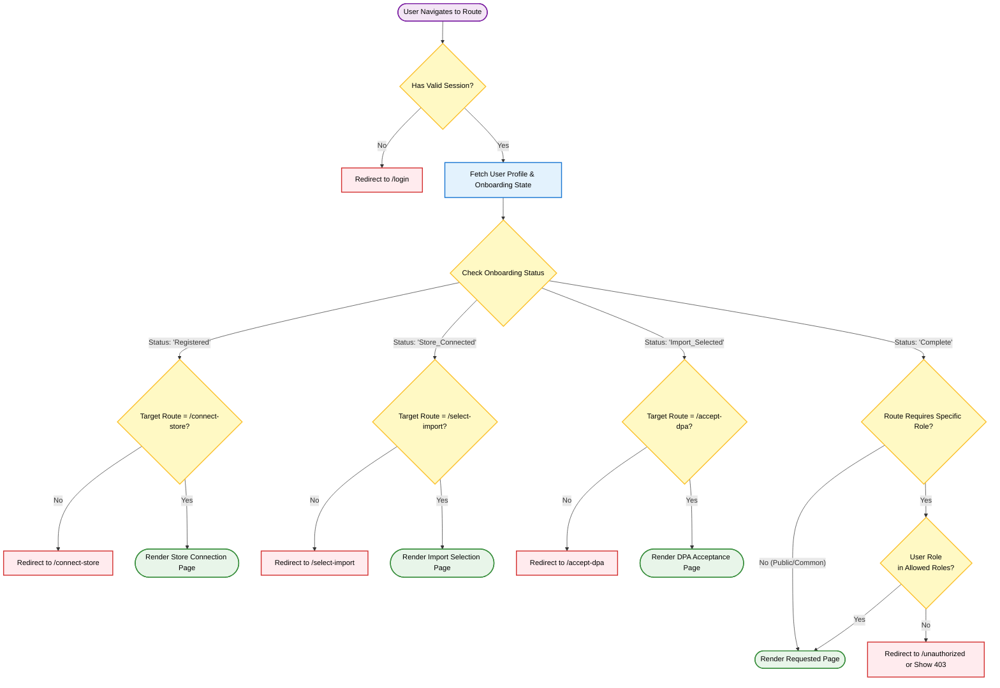

{
  "diagram_info": {
    "diagram_name": "Application Routing & Access Control Flow",
    "diagram_type": "flowchart",
    "purpose": "To document the logic for protecting routes based on authentication status, onboarding progress, and user role permissions.",
    "target_audience": [
      "frontend developers",
      "backend developers",
      "QA engineers",
      "security auditors"
    ],
    "complexity_level": "medium",
    "estimated_review_time": "5 minutes"
  },
  "syntax_validation": "Mermaid syntax verified and tested",
  "rendering_notes": "Optimized for vertical flow with clear decision branches for state management",
  "diagram_elements": {
    "actors_systems": [
      "User",
      "Routing Middleware",
      "Auth Service",
      "User Profile Service"
    ],
    "key_processes": [
      "Session Validation",
      "Onboarding State Verification",
      "Role-Based Access Control (RBAC)"
    ],
    "decision_points": [
      "Is session valid?",
      "Is onboarding complete?",
      "Does route require specific permissions?",
      "Does user have required role?"
    ],
    "success_paths": [
      "Authenticated user accessing dashboard",
      "New user redirected to correct onboarding step"
    ],
    "error_scenarios": [
      "Unauthenticated access attempt",
      "Unauthorized role access",
      "Incomplete onboarding state"
    ],
    "edge_cases_covered": [
      "Session expiry during navigation",
      "Direct URL access to restricted onboarding steps"
    ]
  },
  "accessibility_considerations": {
    "alt_text": "Flowchart illustrating the routing logic: checks for authentication first, then enforces sequential onboarding steps (Connect Store > Import Data > DPA), and finally validates role permissions for protected routes.",
    "color_independence": "Nodes are distinguished by shape and label text in addition to color coding",
    "screen_reader_friendly": "Logical top-down flow with descriptive labels for all redirects and checks",
    "print_compatibility": "High contrast borders and text ensure readability in monochrome"
  },
  "technical_specifications": {
    "mermaid_version": "10.0+ compatible",
    "responsive_behavior": "Vertical layout adapts well to mobile and desktop documentation views",
    "theme_compatibility": "Uses standard class definitions for light/dark mode support",
    "performance_notes": "Represents client-side middleware logic that must execute <50ms"
  },
  "usage_guidelines": {
    "when_to_reference": "When implementing Next.js middleware, configuring route guards, or testing user access flows.",
    "stakeholder_value": {
      "developers": "Exact logic for implementing the routing guard middleware",
      "designers": "Understanding user redirection flows during onboarding",
      "product_managers": "Verifying the enforcement of the onboarding funnel",
      "QA_engineers": "Defining test cases for permission boundaries and redirection logic"
    },
    "maintenance_notes": "Update if new onboarding steps are added or if RBAC hierarchy changes.",
    "integration_recommendations": "Include in the 'Authentication & Routing' section of the technical design document."
  },
  "validation_checklist": [
    "✅ Authentication check is the first barrier",
    "✅ Onboarding states (Store Connect, Import, DPA) are handled sequentially",
    "✅ Role-based access control is applied last",
    "✅ Unauthorized redirects are clearly defined",
    "✅ Syntax validates against Mermaid live editor"
  ]
}

---

# Mermaid Diagram

