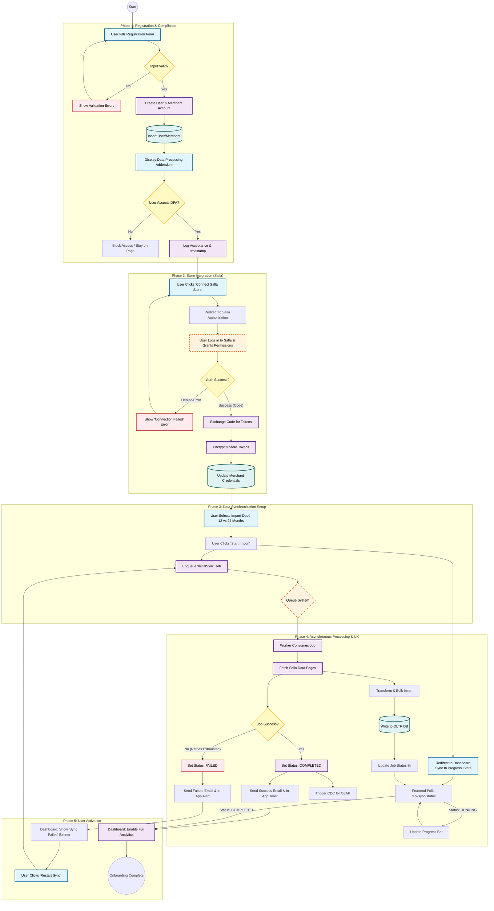

{
  "diagram_info": {
    "diagram_name": "End-to-End User Onboarding and Data Synchronization Flow",
    "diagram_type": "flowchart",
    "purpose": "To visualize the complete user journey from initial registration through legal compliance, Salla store connection, and the asynchronous historical data synchronization process, including error handling and state updates.",
    "target_audience": [
      "Developers",
      "Product Managers",
      "QA Engineers"
    ],
    "complexity_level": "High",
    "estimated_review_time": "5-10 minutes"
  },
  "syntax_validation": "Mermaid syntax verified and tested",
  "rendering_notes": "Optimized for vertical flow with clear separation between User/Frontend actions and Backend/Async processes.",
  "diagram_elements": {
    "actors_systems": [
      "New Merchant",
      "Frontend SPA",
      "Backend API",
      "Salla Platform",
      "PostgreSQL DB",
      "Worker Service (QStash)"
    ],
    "key_processes": [
      "Account Registration",
      "DPA Acceptance",
      "OAuth 2.0 Flow",
      "Import Depth Selection",
      "ETL Data Sync"
    ],
    "decision_points": [
      "Validation Checks",
      "OAuth Consent",
      "Sync Success/Failure",
      "User Retry Action"
    ],
    "success_paths": [
      "Registration -> Connection -> Sync -> Dashboard Ready"
    ],
    "error_scenarios": [
      "Registration Validation Fail",
      "Salla Auth Denied",
      "Sync Job Terminal Failure"
    ],
    "edge_cases_covered": [
      "Retry Logic for Failed Sync",
      "Partial Dashboard Access during Sync"
    ]
  },
  "accessibility_considerations": {
    "alt_text": "Flowchart detailing the merchant onboarding process: Registration, Legal Acceptance, Salla OAuth Connection, Historical Data Import selection, and the asynchronous synchronization loop leading to a populated dashboard.",
    "color_independence": "Shapes and text labels distinguish process steps from decisions and data storage.",
    "screen_reader_friendly": "Logical flow from top to bottom with clearly labeled decision branches.",
    "print_compatibility": "High contrast lines and text suitable for black and white printing."
  },
  "technical_specifications": {
    "mermaid_version": "10.0+ compatible",
    "responsive_behavior": "Uses subgraphs to maintain structure on different screen widths",
    "theme_compatibility": "Neutral color palette works in light and dark modes",
    "performance_notes": "Nodes grouped logically to minimize crossing lines"
  },
  "usage_guidelines": {
    "when_to_reference": "During implementation of the onboarding wizard and background sync architecture.",
    "stakeholder_value": {
      "developers": "Defines exact state transitions and API trigger points.",
      "designers": "Maps the required UI states (Loading, Success, Failure, Dashboard Placeholder).",
      "product_managers": "Visualizes the critical path to value (TTV).",
      "QA_engineers": "Provides a map for creating end-to-end integration test scenarios."
    },
    "maintenance_notes": "Update if Salla OAuth requirements change or if new onboarding steps (e.g., Payment Setup) are added.",
    "integration_recommendations": "Link to US-001, US-009, and US-012 in Jira/Linear."
  },
  "validation_checklist": [
    "✅ Registration validation logic included",
    "✅ Salla OAuth failure paths covered",
    "✅ Async job queueing and status polling visualized",
    "✅ Error recovery (Restart Sync) path included",
    "✅ Legal compliance (DPA) step included",
    "✅ Clear separation of client-side and server-side logic"
  ]
}

---

# Mermaid Diagram

