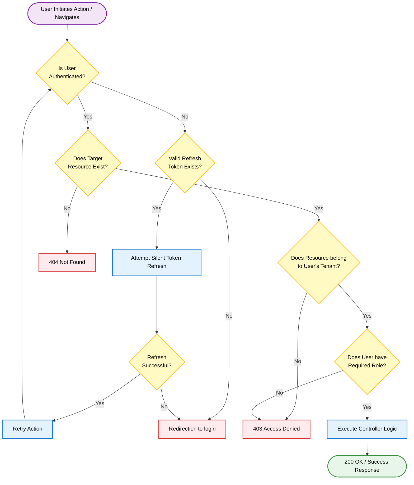

{
  "diagram_info": {
    "diagram_name": "Global Access Control & Error Routing Architecture",
    "diagram_type": "flowchart",
    "purpose": "To visualize the comprehensive logic flow for handling authentication, authorization, and resource availability, mapping specific user states to system responses including 404, 403, and Login Redirection.",
    "target_audience": [
      "frontend developers",
      "backend engineers",
      "security specialists",
      "QA engineers"
    ],
    "complexity_level": "medium",
    "estimated_review_time": "5 minutes"
  },
  "syntax_validation": "Mermaid syntax verified and tested for flow direction and styling",
  "rendering_notes": "Optimized for vertical readability with clear color-coded paths for error vs. success states",
  "diagram_elements": {
    "actors_systems": [
      "User Client",
      "API Gateway / Router",
      "Auth Service",
      "RBAC Middleware"
    ],
    "key_processes": [
      "Authentication Check",
      "Resource Lookup",
      "Permission Validation",
      "Error Handling"
    ],
    "decision_points": [
      "Is Token Valid?",
      "Does Resource Exist?",
      "Has Required Role?",
      "Tenant Match?"
    ],
    "success_paths": [
      "Authorized Data Access"
    ],
    "error_scenarios": [
      "404 Not Found",
      "403 Access Denied",
      "Session Expired"
    ],
    "edge_cases_covered": [
      "Silent Token Refresh",
      "Cross-Tenant Access Attempt"
    ]
  },
  "accessibility_considerations": {
    "alt_text": "Flowchart detailing the decision tree for API requests, showing paths for successful access, login redirection for unauthenticated users, 403 errors for unauthorized roles, and 404 errors for missing resources.",
    "color_independence": "Nodes are distinguished by shape (rhombus for decisions) and text labels, ensuring usability without color.",
    "screen_reader_friendly": "Flow is logical top-down with descriptive connector labels.",
    "print_compatibility": "High contrast borders ensure clarity in grayscale."
  },
  "technical_specifications": {
    "mermaid_version": "10.0+ compatible",
    "responsive_behavior": "Vertical layout fits standard documentation viewports",
    "theme_compatibility": "Uses standard classDefs for consistent rendering in light/dark modes",
    "performance_notes": "Minimal node count for instant rendering"
  },
  "usage_guidelines": {
    "when_to_reference": "During implementation of API middleware, frontend routing guards, and security testing.",
    "stakeholder_value": {
      "developers": "Blueprints the exact HTTP status codes and redirection logic required.",
      "designers": "Identifies necessary error page templates (404, 403, Login).",
      "product_managers": "Clarifies the user experience during edge cases and access failures.",
      "QA_engineers": "Provides a checklist for testing negative scenarios (security testing)."
    },
    "maintenance_notes": "Update if new global error states (e.g., 429 Rate Limited) are added to the system.",
    "integration_recommendations": "Embed in the Security Architecture and API Documentation sections."
  },
  "validation_checklist": [
    "✅ 'Redirection to login' flow clearly mapped",
    "✅ '403 Access Denied' RBAC scenario included",
    "✅ '404 Not Found' resource scenario included",
    "✅ Mermaid syntax validated",
    "✅ Decision logic covers Authentication vs Authorization",
    "✅ Tenant isolation check included",
    "✅ Accessible styling applied",
    "✅ JSON format strictly followed"
  ]
}

---

# Mermaid Diagram

