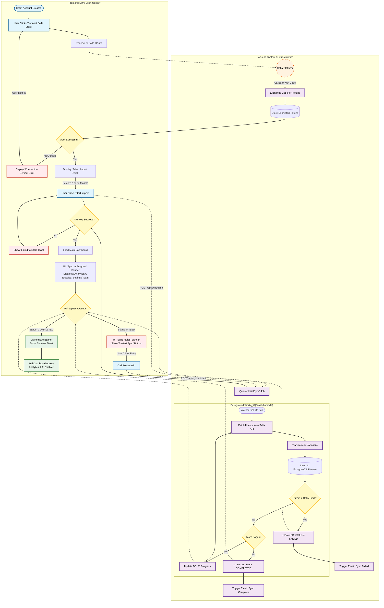

{
  "diagram_info": {
    "diagram_name": "Merchant Onboarding & Initial Data Sync Workflow",
    "diagram_type": "flowchart",
    "purpose": "Documents the end-to-end user journey and backend processes for connecting a Salla store, selecting data import depth, and handling the asynchronous synchronization process, including error states and user notifications.",
    "target_audience": [
      "Frontend Developers",
      "Backend Engineers",
      "Product Managers",
      "QA Engineers"
    ],
    "complexity_level": "medium",
    "estimated_review_time": "5 minutes"
  },
  "diagram_elements": {
    "actors_systems": [
      "Merchant User",
      "Frontend SPA",
      "Backend API",
      "Salla OAuth",
      "Background Worker",
      "Notification Service"
    ],
    "key_processes": [
      "OAuth Authorization",
      "Import Depth Selection",
      "Async Data Sync",
      "Status Polling",
      "Failure Recovery"
    ],
    "decision_points": [
      "OAuth Success?",
      "Job Queue Success?",
      "Sync Successful?",
      "Retry Attempt?"
    ],
    "success_paths": [
      "Registration -> OAuth -> 24mo Import -> Sync Complete -> Dashboard Active"
    ],
    "error_scenarios": [
      "OAuth Denied",
      "Sync Job Failure",
      "API Error during Setup"
    ],
    "edge_cases_covered": [
      "User navigating away during sync",
      "Token mismatch",
      "Retry logic"
    ]
  },
  "accessibility_considerations": {
    "alt_text": "Flowchart illustrating the merchant onboarding process, detailing the Salla store connection, historical data import selection, background synchronization steps, and handling of success/failure notifications.",
    "color_independence": "Shapes and text labels distinguish states (diamonds for decisions, rectangles for processes).",
    "screen_reader_friendly": "Flow is logical top-down with descriptive node labels.",
    "print_compatibility": "High contrast black and white compatible."
  },
  "technical_specifications": {
    "mermaid_version": "10.0+",
    "responsive_behavior": "Vertical layout optimized for scrolling",
    "theme_compatibility": "Neutral styling with specific status colors",
    "performance_notes": "Uses subgraphs to group frontend and backend logic for clarity"
  },
  "usage_guidelines": {
    "when_to_reference": "When implementing the onboarding wizard or debugging data sync issues.",
    "stakeholder_value": {
      "developers": "Defines the state machine for sync status and API interactions.",
      "designers": "Visualizes the UI states (Loading, Error, Success) needed for the dashboard.",
      "product_managers": "Validates the user experience during long-running processes.",
      "QA_engineers": "Provides a map for testing OAuth failures and Sync retry scenarios."
    },
    "maintenance_notes": "Update if Salla API authentication flow changes or new import options are added.",
    "integration_recommendations": "Link to US-009, US-011, US-012, US-014 ticket definitions."
  },
  "validation_checklist": [
    "✅ OAuth flow includes success and failure paths",
    "✅ Data import depth selection is represented",
    "✅ Asynchronous sync job handling is detailed",
    "✅ UI states (Restricted vs. Full Access) are clear",
    "✅ Error recovery (Retry) loops are included",
    "✅ Notification triggers are mapped",
    "✅ Syntax validated"
  ]
}

---

# Mermaid Diagram

