{
  "diagram_info": {
    "diagram_name": "PWA Information Architecture & Navigation Map",
    "diagram_type": "flowchart",
    "purpose": "To define the high-level structure and navigation hierarchy of the SaaS PWA, mapping the relationships between the Dashboard, core modules (Analytics, Cart Recovery), and administrative settings.",
    "target_audience": [
      "Frontend Developers",
      "UX/UI Designers",
      "Product Managers",
      "QA Engineers"
    ],
    "complexity_level": "medium",
    "estimated_review_time": "5 minutes"
  },
  "syntax_validation": "Mermaid syntax verified and tested",
  "rendering_notes": "Optimized for hierarchical clarity using Top-Down (TD) layout with distinct subgraphs for functional modules.",
  "diagram_elements": {
    "actors_systems": [
      "Authenticated User",
      "Application Shell",
      "Global Navigation"
    ],
    "key_processes": [
      "Module Navigation",
      "Context Switching (Merchant Accounts)",
      "Feature Access"
    ],
    "decision_points": [
      "Role-Based Access Control (RBAC)"
    ],
    "success_paths": [
      "Access Dashboard",
      "Drill-down to Reports",
      "Configure Cart Recovery",
      "Manage Team"
    ],
    "error_scenarios": [
      "Access Denied (RBAC Block)",
      "Data Sync Pending"
    ],
    "edge_cases_covered": [
      "Account Switching",
      "AI Assistant Overlay"
    ]
  },
  "accessibility_considerations": {
    "alt_text": "Hierarchical site map of the PWA showing the Dashboard, Deep Analytics, Cart Recovery, and Settings modules flowing from the main navigation.",
    "color_independence": "Structure is defined by connection lines and shapes, not color coding alone.",
    "screen_reader_friendly": "Nodes have descriptive labels indicating page titles and key components.",
    "print_compatibility": "High contrast borders and text ensure readability in monochrome."
  },
  "technical_specifications": {
    "mermaid_version": "10.0+ compatible",
    "responsive_behavior": "Vertical layout adapts well to documentation viewing; grouping allows for logical segmentation.",
    "theme_compatibility": "Neutral color palette works in both light and dark modes.",
    "performance_notes": "Uses standard flowchart nodes for minimal rendering overhead."
  },
  "usage_guidelines": {
    "when_to_reference": "During frontend routing setup, navigation component implementation, and user journey mapping.",
    "stakeholder_value": {
      "developers": "Defines the route structure and parent-child relationships for React Router/Next.js.",
      "designers": "Visualizes the scope of the UI and required navigation elements.",
      "product_managers": "Ensures all functional requirements (FRs) have a home in the UI architecture.",
      "qa_engineers": "Provides a map for navigation testing and smoke testing of all modules."
    },
    "maintenance_notes": "Update this diagram when new top-level modules or significant sub-features are added.",
    "integration_recommendations": "Include in the 'Frontend Architecture' section of the technical design document."
  },
  "validation_checklist": [
    "✅ Main Dashboard with KPIs and Insights included",
    "✅ Deep Analytics breakdown (Sales, Customers, Products) present",
    "✅ Cart Recovery workflow (List, Templates, Sequences) mapped",
    "✅ Settings and Administration hierarchy defined",
    "✅ Navigation logic and hierarchy is clear",
    "✅ Global elements (AI Assistant, Account Switcher) represented",
    "✅ Mermaid syntax is valid"
  ]
}

---

# Mermaid Diagram

```mermaid
flowchart TD
    %% Root Entry
    User((Authenticated User)) --> AppShell[Application Shell / Layout]

    %% Global Elements
    subgraph Global_Nav [Global Navigation & Tools]
        AppShell --> Nav{Main Navigation Bar}
        AppShell --> GlobalTools[Global Tools]
        GlobalTools --> AcctSwitch[Account Switcher]
        GlobalTools --> AIAssist[AI Assistant Overlay]
        GlobalTools --> Help[Knowledge Base / Help]
    end

    %% Module: Dashboard
    Nav --> |Default View| Dashboard[Main Dashboard]
    subgraph Mod_Dashboard [Dashboard Module]
        Dashboard --> DB_KPIs[Key Performance Indicators]
        Dashboard --> DB_Filter[Global Date Filter]
        Dashboard --> DB_Insights[AI Insights & Alerts]
        Dashboard --> DB_Forecast[30-Day Sales Forecast Widget]
    end

    %% Module: Deep Analytics
    Nav --> Analytics[Deep Analytics]
    subgraph Mod_Analytics [Analytics Module]
        Analytics --> Rep_Sales[Sales Trends Report]
        Analytics --> Rep_Prod[Product Performance]
        Analytics --> Rep_Cust[Customer Segmentation]
        Rep_Cust --> Cust_Loc[Location Analysis]
        Rep_Cust --> Cust_Value[New vs Returning / RFM]
    end

    %% Module: Cart Recovery
    Nav --> CartRec[Cart Recovery]
    subgraph Mod_CartRec [Cart Recovery Module]
        CartRec --> CR_List[Abandoned Carts List]
        CartRec --> CR_Seqs[Automated Sequences]
        CR_Seqs --> CR_EditSeq[Sequence Editor]
        CartRec --> CR_Tmpl[Email Templates]
        CR_Tmpl --> CR_EditTmpl[Rich Text Editor]
        CartRec --> CR_Stats[Performance Dashboard]
    end

    %% Module: Settings
    Nav --> Settings[Settings]
    subgraph Mod_Settings [Settings & Config]
        Settings --> Set_Profile[User Profile]
        Settings --> Set_Team[Team Management]
        Set_Team --> Act_Invite[Invite Member]
        Settings --> Set_Integ[Salla Integration]
        Settings --> Set_Domain[Sending Domain Config]
        Settings --> Set_Compl[Compliance / DSAR]
    end

    %% Relationships and Cross-Links
    DB_Insights -.-> |Drill Down| Rep_Sales
    CR_List -.-> |Manual Recovery| CR_Tmpl
    Set_Team -.-> |RBAC Control| AppShell

    %% Styling
    classDef shell fill:#f5f5f5,stroke:#333,stroke-width:2px,color:#000
    classDef module fill:#e1f5fe,stroke:#0277bd,stroke-width:2px,color:#000
    classDef page fill:#ffffff,stroke:#0277bd,stroke-width:1px,color:#000
    classDef tool fill:#fff3e0,stroke:#ef6c00,stroke-width:1px,stroke-dasharray: 5 5,color:#000

    class AppShell shell
    class Dashboard,Analytics,CartRec,Settings module
    class DB_KPIs,DB_Filter,DB_Insights,DB_Forecast,Rep_Sales,Rep_Prod,Rep_Cust,Cust_Loc,Cust_Value,CR_List,CR_Seqs,CR_EditSeq,CR_Tmpl,CR_EditTmpl,CR_Stats,Set_Profile,Set_Team,Act_Invite,Set_Integ,Set_Domain,Set_Compl page
    class AcctSwitch,AIAssist,Help tool
```

