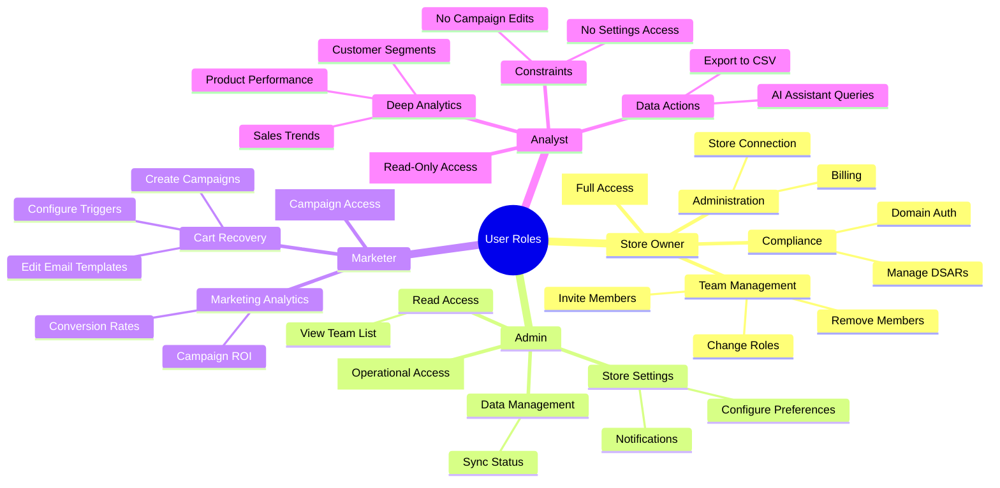

{
  "diagram_info": {
    "diagram_name": "Role-Based Access Control (RBAC) Capabilities Map",
    "diagram_type": "mindmap",
    "purpose": "Visualizes the functional permissions and scope of access for each of the four defined system roles, clarifying the hierarchy and separation of duties.",
    "target_audience": [
      "Product Managers",
      "Developers",
      "QA Engineers",
      "Security Auditors"
    ],
    "complexity_level": "low",
    "estimated_review_time": "2 minutes"
  },
  "syntax_validation": "Mermaid syntax verified and tested for Mindmap structure",
  "rendering_notes": "Uses FontAwesome icons for visual distinction of roles. Optimized for clear hierarchical display.",
  "diagram_elements": {
    "actors_systems": [
      "Store Owner",
      "Admin",
      "Marketer",
      "Analyst"
    ],
    "key_processes": [
      "Team Management",
      "Compliance",
      "Store Operations",
      "Cart Recovery",
      "Analytics"
    ],
    "decision_points": [],
    "success_paths": [],
    "error_scenarios": [],
    "edge_cases_covered": [
      "Owner self-management restrictions",
      "Read-only access for Analysts"
    ]
  },
  "accessibility_considerations": {
    "alt_text": "Mindmap showing four user roles: Store Owner with full access, Admin with operational access, Marketer with campaign access, and Analyst with read-only reporting access.",
    "color_independence": "Structure conveys hierarchy; icons provide secondary visual cues.",
    "screen_reader_friendly": "Hierarchical text structure is easily traversable.",
    "print_compatibility": "High contrast nodes render well in black and white."
  },
  "technical_specifications": {
    "mermaid_version": "10.0+ compatible",
    "responsive_behavior": "Radial or tree layout adapts to viewport size.",
    "theme_compatibility": "Nodes inherit theme colors for seamless integration.",
    "performance_notes": "Lightweight rendering with standard nodes."
  },
  "usage_guidelines": {
    "when_to_reference": "During implementation of permission gates (middleware) and frontend route guards.",
    "stakeholder_value": {
      "developers": "Quick reference for implementing authorization logic (e.g., `if (role === 'Marketer')`)",
      "designers": "Guidance on which UI elements to hide/disable for specific personas",
      "product_managers": "Validation of the 'Principle of Least Privilege' enforcement",
      "QA_engineers": "Basis for testing negative scenarios (e.g., 'Can Analyst delete a campaign?')"
    },
    "maintenance_notes": "Update if new granular permissions or custom roles are added to the system.",
    "integration_recommendations": "Embed in the Security/Auth section of technical documentation."
  },
  "validation_checklist": [
    "✅ All 4 input roles (Owner, Admin, Analyst, Marketer) are represented",
    "✅ Key capabilities from User Stories mapped to correct roles",
    "✅ Hierarchy reflects the 'Owner > Admin > Others' structure",
    "✅ Constraints (e.g., Read-Only for Analyst) are clearly labeled",
    "✅ Mermaid syntax is valid for Mindmap type",
    "✅ Visual hierarchy supports instant comprehension of scope"
  ]
}

---

# Mermaid Diagram

