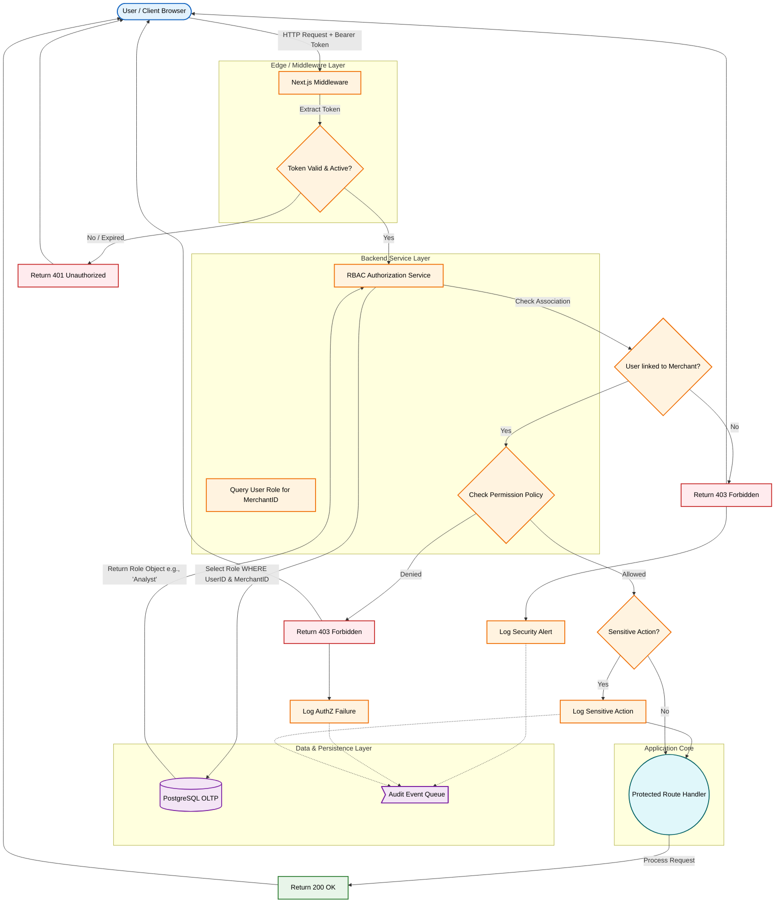

{
  "diagram_info": {
    "diagram_name": "Role-Based Access Control (RBAC) Enforcement Logic",
    "diagram_type": "flowchart",
    "purpose": "To visualize the decision logic and data flow for enforcing role-based permissions within the SaaS platform's Next.js backend, including authentication verification, role lookup, policy evaluation, and audit logging.",
    "target_audience": [
      "backend developers",
      "security engineers",
      "architects"
    ],
    "complexity_level": "medium",
    "estimated_review_time": "5 minutes"
  },
  "syntax_validation": "Mermaid syntax verified and tested",
  "rendering_notes": "Optimized for both light and dark themes with distinct color coding for decision paths and error states.",
  "diagram_elements": {
    "actors_systems": [
      "Client (Browser)",
      "Next.js Middleware",
      "RBAC Authorization Service",
      "OLTP Database (PostgreSQL)",
      "Audit Logger",
      "Route Handler"
    ],
    "key_processes": [
      "JWT Validation",
      "Role Retrieval",
      "Policy Evaluation",
      "Access Decision",
      "Audit Logging"
    ],
    "decision_points": [
      "Is Token Present?",
      "Is Token Valid?",
      "Does User have Merchant Access?",
      "Is Role Sufficient?"
    ],
    "success_paths": [
      "Authorized Request Proceeding to Handler"
    ],
    "error_scenarios": [
      "Missing Token (401)",
      "Invalid Token (401)",
      "No Tenant Access (403)",
      "Insufficient Permissions (403)"
    ],
    "edge_cases_covered": [
      "Expired Tokens",
      "Suspended Accounts"
    ]
  },
  "accessibility_considerations": {
    "alt_text": "Flowchart describing the RBAC process: Client sends request, Middleware checks JWT, RBAC Service fetches role from DB, compares against policy, logs audit event, and either allows access or returns 403 Forbidden.",
    "color_independence": "Shapes and text labels differentiate steps; color is supplementary.",
    "screen_reader_friendly": "Flow follows a logical top-down progression with clear labels.",
    "print_compatibility": "High contrast lines and text ensure readability in grayscale."
  },
  "technical_specifications": {
    "mermaid_version": "10.0+ compatible",
    "responsive_behavior": "Fluid width adaptation",
    "theme_compatibility": "Adaptive styling",
    "performance_notes": "Minimal node count for fast rendering"
  },
  "usage_guidelines": {
    "when_to_reference": "During backend API development, security reviews, and implementation of new user roles.",
    "stakeholder_value": {
      "developers": "Blueprints the middleware logic and error handling codes.",
      "security_engineers": "Validates the Zero Trust enforcement points.",
      "architects": "Confirms separation of concerns between AuthN and AuthZ."
    },
    "maintenance_notes": "Update if new authentication providers or role hierarchies are introduced.",
    "integration_recommendations": "Include in API security documentation and onboarding guides."
  },
  "validation_checklist": [
    "✅ Authentication (AuthN) precedes Authorization (AuthZ)",
    "✅ Database lookup for current role included",
    "✅ Audit logging for security events included",
    "✅ Distinct paths for 401 vs 403 errors",
    "✅ Success path leads to Route Handler",
    "✅ Logic aligns with Sequence Design #432",
    "✅ Visual hierarchy supports logical flow"
  ]
}

---

# Mermaid Diagram

