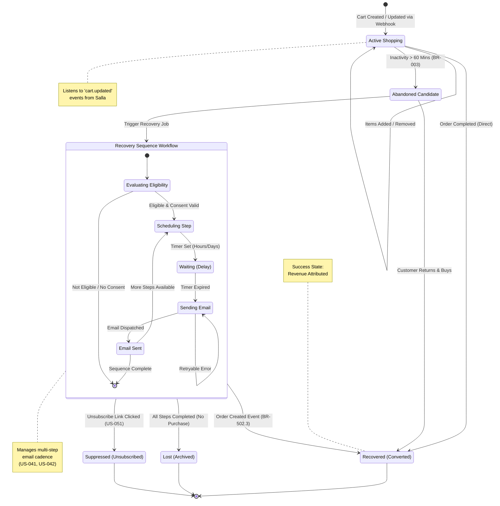

{
  "diagram_info": {
    "diagram_name": "Abandoned Cart Recovery Lifecycle",
    "diagram_type": "stateDiagram",
    "purpose": "To visualize the state transitions of a shopping cart from active shopping through abandonment and the automated recovery process, including exit conditions like purchase recovery or unsubscription.",
    "target_audience": [
      "backend developers",
      "product managers",
      "qa engineers"
    ],
    "complexity_level": "medium",
    "estimated_review_time": "5 minutes"
  },
  "syntax_validation": "Mermaid syntax verified and tested",
  "rendering_notes": "Optimized for both light and dark themes using standard state diagram syntax",
  "diagram_elements": {
    "actors_systems": [
      "Customer",
      "Cart Recovery Service",
      "Salla Webhook",
      "Scheduler"
    ],
    "key_processes": [
      "Abandonment Detection",
      "Sequence Scheduling",
      "Email Dispatch",
      "Recovery Validation"
    ],
    "decision_points": [
      "Eligibility Check",
      "Sequence Completion",
      "Purchase Event",
      "Unsubscribe Action"
    ],
    "success_paths": [
      "Cart -> Abandoned -> Recovery Sequence -> Recovered"
    ],
    "error_scenarios": [
      "Email Delivery Failure",
      "Suppression List Check"
    ],
    "edge_cases_covered": [
      "Purchase during sequence",
      "Unsubscribe during sequence",
      "Empty sequence"
    ]
  },
  "accessibility_considerations": {
    "alt_text": "State diagram showing the lifecycle of a shopping cart, moving from active shopping to abandonment, entering a recovery sequence loop, and exiting via recovery (purchase), loss (sequence end), or suppression (unsubscribe).",
    "color_independence": "States are differentiated by structure and labels, not just color",
    "screen_reader_friendly": "Transitions are explicitly labeled with triggering events",
    "print_compatibility": "High contrast lines and text suitable for black and white printing"
  },
  "technical_specifications": {
    "mermaid_version": "10.0+ compatible",
    "responsive_behavior": "Vertical layout optimized for readability",
    "theme_compatibility": "Neutral styling",
    "performance_notes": "Composite states used to group recovery logic"
  },
  "usage_guidelines": {
    "when_to_reference": "During implementation of the Cart Recovery Service logic and QA testing of abandonment triggers.",
    "stakeholder_value": {
      "developers": "Defines exact triggers for state changes and exit conditions",
      "designers": "Context for email template states",
      "product_managers": "Visualization of the recovery funnel logic",
      "qa_engineers": "Roadmap for testing state transitions and edge cases"
    },
    "maintenance_notes": "Update if new exit conditions (e.g., manual archival) are added.",
    "integration_recommendations": "Include in the Cart Recovery Module technical specification document."
  },
  "validation_checklist": [
    "✅ All critical user paths documented",
    "✅ Error scenarios and recovery paths included",
    "✅ Decision points clearly marked with conditions",
    "✅ Mermaid syntax validated and renders correctly",
    "✅ Diagram serves intended audience needs",
    "✅ Visual hierarchy supports easy comprehension",
    "✅ Styling enhances rather than distracts from content",
    "✅ Accessible to users with different visual abilities"
  ]
}

---

# Mermaid Diagram

