{
  "diagram_info": {
    "diagram_name": "Cart Recovery Automation Configuration Flow",
    "diagram_type": "flowchart",
    "purpose": "To visualize the end-to-end user journey for creating and configuring automated cart recovery sequences, including step management, timing configuration, and template integration.",
    "target_audience": [
      "Frontend Developers",
      "UX Designers",
      "Product Owners"
    ],
    "complexity_level": "high",
    "estimated_review_time": "5-10 minutes"
  },
  "diagram_elements": {
    "actors_systems": [
      "User (Marketer/Owner)",
      "Sequence Editor UI",
      "Template Editor Modal",
      "Backend Validation"
    ],
    "key_processes": [
      "Create Sequence",
      "Add/Configure Steps",
      "Template Selection/Creation",
      "Validation",
      "Activation"
    ],
    "decision_points": [
      "Add Step vs Save",
      "Select Existing vs Create New Template",
      "Validation Success/Failure",
      "Activate Immediately"
    ],
    "success_paths": [
      "Sequence created with multiple steps and templates",
      "Template created within flow"
    ],
    "error_scenarios": [
      "Missing step configuration",
      "Invalid delay values",
      "Duplicate template names"
    ],
    "edge_cases_covered": [
      "Zero steps",
      "Negative delay",
      "Unsaved changes cancellation"
    ]
  },
  "accessibility_considerations": {
    "alt_text": "Flowchart detailing the process of creating a cart recovery sequence, moving from the dashboard to the editor, configuring time delays, selecting templates, and handling validation errors before saving.",
    "color_independence": "Shapes (diamonds for decisions, rectangles for processes) and text labels distinguish flow steps.",
    "screen_reader_friendly": "Logical flow order top-to-bottom with descriptive node labels.",
    "print_compatibility": "High contrast borders and text ensure readability in monochrome."
  },
  "technical_specifications": {
    "mermaid_version": "10.9+",
    "responsive_behavior": "Vertical layout optimized for scrolling; subgraphs group related UI contexts.",
    "theme_compatibility": "Uses Design System color palette variables for consistent branding.",
    "performance_notes": "Nodes grouped by context to reduce visual clutter."
  },
  "usage_guidelines": {
    "when_to_reference": "During implementation of US-041 (Sequence Creation) and US-043 (Template Editor).",
    "stakeholder_value": {
      "developers": "Defines state transitions and validation triggers for the Sequence Editor component.",
      "designers": "Validates the interaction model between the main editor and the template modal.",
      "product_managers": "Ensures all business rules regarding timing and mandatory fields are represented.",
      "qa_engineers": "Provides a map for testing happy paths and error conditions in the configuration flow."
    },
    "maintenance_notes": "Update if new step types (e.g., SMS) are added or if validation rules change.",
    "integration_recommendations": "Link in the 'Cart Sequence Editor' component documentation."
  },
  "validation_checklist": [
    "✅ Covers US-041 (Multi-step sequence creation)",
    "✅ Covers US-042 (Timing configuration logic)",
    "✅ Covers US-043 & US-044 (Template creation & variables)",
    "✅ Includes validation error loops (AC-002, AC-003)",
    "✅ Mermaid syntax valid and styling applied",
    "✅ Visual hierarchy separates Sequence level from Step level actions",
    "✅ Error paths clearly return to correction states",
    "✅ Accessible color contrast used"
  ]
}

---

# Mermaid Diagram

```mermaid
flowchart TD
    %% Define styles based on Design System
    classDef primary fill:#eef2ff,stroke:#4f46e5,stroke-width:2px,color:#312e81
    classDef action fill:#fff,stroke:#4f46e5,stroke-width:2px,stroke-dasharray: 5 5,color:#4f46e5
    classDef decision fill:#fffbeb,stroke:#f59e0b,stroke-width:2px,color:#78350f
    classDef error fill:#fef2f2,stroke:#ef4444,stroke-width:2px,color:#7f1d1d
    classDef success fill:#ecfdf5,stroke:#10b981,stroke-width:2px,color:#064e3b
    classDef ui fill:#f8fafc,stroke:#94a3b8,stroke-width:1px,color:#0f172a

    start((Start)) --> view_list[View Cart Recovery Dashboard]
    view_list --> |Click 'Create New Sequence'| init_seq[Enter Sequence Name]
    
    subgraph Sequence_Editor [Sequence Editor UI]
        direction TB
        init_seq --> check_steps{Has Steps?}
        
        check_steps -- No --> add_step_action[Click 'Add Step']
        check_steps -- Yes --> edit_loop
        
        add_step_action --> step_config_ui[Step Configuration Card]
        
        subgraph Step_Configuration [Step Configuration]
            step_config_ui --> set_timing[Set Delay Value & Unit]
            set_timing -- US-042 --> validate_timing{Valid Positive Integer?}
            
            validate_timing -- No --> timing_error[Show 'Invalid Delay' Error]:::error
            timing_error --> set_timing
            
            validate_timing -- Yes --> select_template{Select Template}
            
            select_template -- Choose Existing --> pick_list[Dropdown: Select Saved Template]
            select_template -- Create New --> open_modal[Open Template Editor Modal]
            
            pick_list --> step_ready[Step Configured]
        end
        
        subgraph Template_Modal [Template Editor Modal US-043]
            open_modal --> edit_content[Rich Text Editor]
            edit_content --> insert_vars[Insert Dynamic Variables US-044]
            insert_vars --> save_tpl_click{Click 'Save Template'}
            
            save_tpl_click --> validate_tpl{Name Unique & Subject Set?}
            validate_tpl -- No --> tpl_error[Show Inline Validation Error]:::error
            tpl_error --> edit_content
            
            validate_tpl -- Yes --> save_tpl_db[(Persist Template)]
            save_tpl_db --> close_modal[Close Modal & Auto-select]
        end
        
        close_modal --> step_ready
        step_ready --> edit_loop{Add Another / Edit?}
        edit_loop -- Add Step --> add_step_action
        edit_loop -- Remove Step --> remove_step[Remove Step UI]
        remove_step --> check_steps
        
        edit_loop -- "Done Editing" --> save_seq_click[Click 'Save Sequence']
    end

    save_seq_click --> final_validate{Validation Pass? US-041}
    
    final_validate -- "Fail (e.g. 0 steps)" --> seq_error[Show Global Error Toast]:::error
    seq_error --> edit_loop
    
    final_validate -- Pass --> activate_check{Activate Immediately?}
    
    activate_check -- Yes --> set_active[Set Status = ACTIVE]
    activate_check -- No --> set_draft[Set Status = DRAFT]
    
    set_active --> persist_seq[(Save Sequence to DB)]
    set_draft --> persist_seq
    
    persist_seq --> success_toast[Show 'Sequence Saved' Notification]:::success
    success_toast --> end_node((End))

    %% Apply Styles
    class start,end_node,view_list,step_ready ui
    class init_seq,add_step_action,set_timing,edit_content,insert_vars,pick_list,set_active,set_draft primary
    class save_tpl_click,save_seq_click,open_modal,remove_step action
    class check_steps,validate_timing,select_template,validate_tpl,edit_loop,final_validate,activate_check decision
    class persist_seq,save_tpl_db success

    %% Link styles
    linkStyle default stroke:#64748b,stroke-width:2px,fill:none
```

