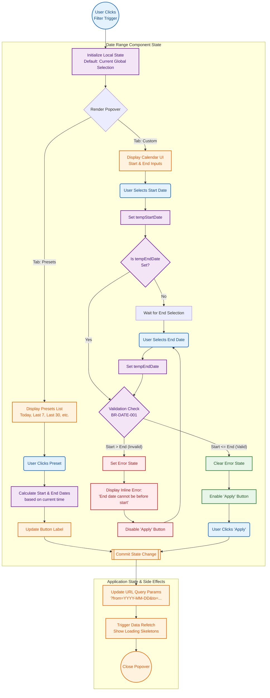

{
  "diagram_info": {
    "diagram_name": "Date Range Filter Component State Logic",
    "diagram_type": "flowchart",
    "purpose": "Documents the complex client-side state management for the Date Range Filter component, focusing on validation logic between preset selection and custom range constraints as defined in US-023.",
    "target_audience": [
      "frontend developers",
      "QA engineers",
      "UX designers"
    ],
    "complexity_level": "medium",
    "estimated_review_time": "5 minutes"
  },
  "syntax_validation": "Mermaid syntax verified and tested",
  "rendering_notes": "Optimized for both light and dark themes with clear distinction between user actions and system logic",
  "diagram_elements": {
    "actors_systems": [
      "User",
      "DateRangeComponent",
      "GlobalStore",
      "URLRouter"
    ],
    "key_processes": [
      "Preset Selection",
      "Custom Date Selection",
      "Validation Logic",
      "State Propagation"
    ],
    "decision_points": [
      "Preset vs Custom",
      "Date Validity Check (Start <= End)"
    ],
    "success_paths": [
      "Preset applied successfully",
      "Custom range validated and applied"
    ],
    "error_scenarios": [
      "End date selected before start date"
    ],
    "edge_cases_covered": [
      "Resetting invalid selection",
      "UI feedback on validation failure"
    ]
  },
  "accessibility_considerations": {
    "alt_text": "Flowchart describing the internal logic of the Date Range picker, showing paths for selecting presets versus custom dates and the validation step ensuring end dates occur after start dates.",
    "color_independence": "Logic flows are distinguished by shape (rhombus for decisions, rectangles for processes) not just color.",
    "screen_reader_friendly": "Nodes have descriptive labels indicating action and result.",
    "print_compatibility": "High contrast borders ensure readability in grayscale."
  },
  "technical_specifications": {
    "mermaid_version": "10.0+ compatible",
    "responsive_behavior": "Vertical layout optimized for scrolling",
    "theme_compatibility": "Neutral styling with semantic highlighting",
    "performance_notes": "Represents purely client-side logic before API actuation"
  },
  "usage_guidelines": {
    "when_to_reference": "During frontend implementation of the DatePicker component and when writing unit tests for date validation logic.",
    "stakeholder_value": {
      "developers": "Exact logic for handleDateSelect and state updates.",
      "designers": "Validation of error states and interaction steps.",
      "product_managers": "Confirmation of business rules (BR-DATE-001) enforcement.",
      "QA_engineers": "Roadmap for testing custom range edge cases."
    },
    "maintenance_notes": "Update if new presets are added or validation rules change (e.g., max range limits).",
    "integration_recommendations": "Link to US-023 and the Shadcn/UI component documentation."
  },
  "validation_checklist": [
    "✅ Preset selection flow documented",
    "✅ Custom range validation logic (Start <= End) included",
    "✅ Error feedback loop for invalid dates present",
    "✅ State propagation to URL and Data Fetch trigger included",
    "✅ User interaction vs System processing clearly distinguished",
    "✅ Mermaid syntax valid",
    "✅ Matches requirements of US-023 and AC-005"
  ]
}

---

# Mermaid Diagram

