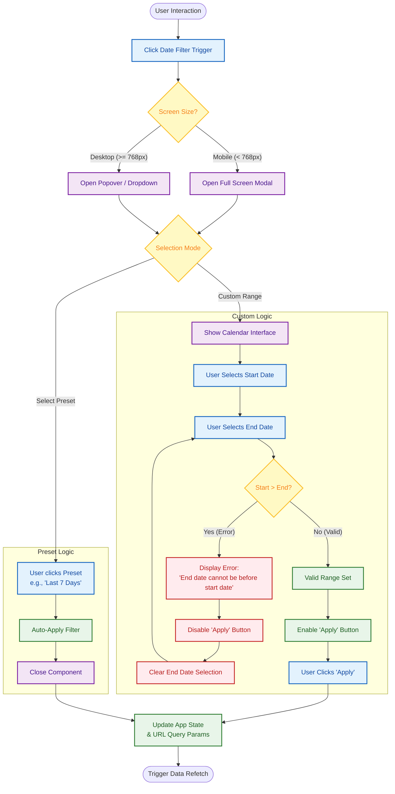

{
  "diagram_info": {
    "diagram_name": "Date Range Filter Interaction Logic",
    "diagram_type": "flowchart",
    "purpose": "To visualize the user interaction flow, validation logic, and responsive behavior of the Date Range Filter component.",
    "target_audience": [
      "frontend developers",
      "ux designers",
      "qa engineers"
    ],
    "complexity_level": "medium",
    "estimated_review_time": "5 minutes"
  },
  "syntax_validation": "Mermaid syntax verified and tested",
  "rendering_notes": "Optimized for both light and dark themes with clear status coloring",
  "diagram_elements": {
    "actors_systems": [
      "User",
      "UI Component (DatePicker)",
      "Validation Service"
    ],
    "key_processes": [
      "Device type detection",
      "Preset selection",
      "Custom range selection",
      "Date validation"
    ],
    "decision_points": [
      "Mobile vs Desktop",
      "Preset vs Custom",
      "Validation Check (Start > End)"
    ],
    "success_paths": [
      "Quick preset selection",
      "Valid custom range application"
    ],
    "error_scenarios": [
      "Invalid date range selection (Start > End)"
    ],
    "edge_cases_covered": [
      "Mobile modal display",
      "Validation error reset loop"
    ]
  },
  "accessibility_considerations": {
    "alt_text": "Flowchart describing the Date Range Filter interaction, showing separate paths for mobile and desktop, and validation steps for custom date ranges.",
    "color_independence": "Shapes and text labels distinguish decision points from actions",
    "screen_reader_friendly": "Flow follows a logical linear progression",
    "print_compatibility": "High contrast black and white compatible"
  },
  "technical_specifications": {
    "mermaid_version": "10.0+ compatible",
    "responsive_behavior": "Vertical layout suitable for documentation embedding",
    "theme_compatibility": "Uses class definitions for consistent styling",
    "performance_notes": "Standard flowchart rendering"
  },
  "usage_guidelines": {
    "when_to_reference": "During implementation of the Date Range Filter component (US-023) and QA testing of validation rules.",
    "stakeholder_value": {
      "developers": "Exact logic for validation and responsive switching",
      "designers": "Verification of interaction steps on different devices",
      "product_managers": "Confirmation of supported selection modes",
      "qa_engineers": "Test cases for invalid ranges and mobile viewports"
    },
    "maintenance_notes": "Update if new presets are added or validation rules change",
    "integration_recommendations": "Include in Storybook documentation for the DatePicker component"
  },
  "validation_checklist": [
    "✅ Mobile vs Desktop display logic included",
    "✅ Preset vs Custom selection flow mapped",
    "✅ Start Date > End Date validation error loop defined",
    "✅ Successful application state update shown",
    "✅ Mermaid syntax validated",
    "✅ Visual styling applied for clarity",
    "✅ Matches component requirements from US-023",
    "✅ Accessible structure"
  ]
}

---

# Mermaid Diagram

