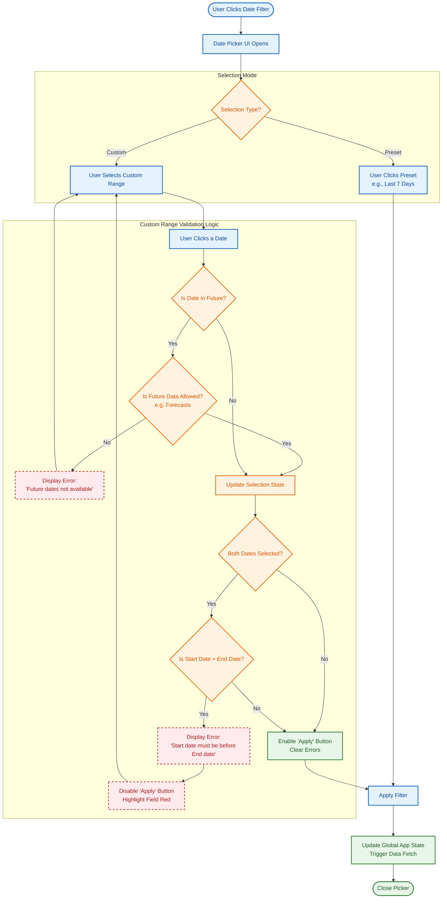

{
  "diagram_info": {
    "diagram_name": "Date Range Filter Logic & Validation Flow",
    "diagram_type": "flowchart",
    "purpose": "To visualize the internal logic, user interactions, and validation states of the Date Range Picker component, specifically focusing on error handling for invalid ranges and future dates.",
    "target_audience": [
      "Frontend Developers",
      "QA Engineers",
      "UX Designers"
    ],
    "complexity_level": "medium",
    "estimated_review_time": "5 minutes"
  },
  "diagram_elements": {
    "actors_systems": [
      "User",
      "Date Picker Component",
      "Validation Logic",
      "Global State"
    ],
    "key_processes": [
      "Preset Selection",
      "Custom Date Selection",
      "Validation Checks",
      "Filter Application"
    ],
    "decision_points": [
      "Is Preset?",
      "Is Future Date Allowed?",
      "Is Start Date > End Date?",
      "Are both dates selected?"
    ],
    "success_paths": [
      "Select Preset -> Apply",
      "Select Valid Range -> Apply"
    ],
    "error_scenarios": [
      "Future date selection (when restricted)",
      "End date before Start date"
    ],
    "edge_cases_covered": [
      "Single date selection behavior",
      "Clearing filters"
    ]
  },
  "accessibility_considerations": {
    "alt_text": "Flowchart describing the Date Range Picker interaction, detailing the validation steps for future dates and invalid ranges.",
    "color_independence": "Nodes are differentiated by shape and border style, not just color.",
    "screen_reader_friendly": "Flow follows a logical top-down sequence.",
    "print_compatibility": "High contrast black and white compatible."
  },
  "technical_specifications": {
    "mermaid_version": "10.0+",
    "responsive_behavior": "Vertical layout optimized for scrolling",
    "theme_compatibility": "Neutral colors suitable for light and dark modes",
    "performance_notes": "Logic executes client-side for immediate feedback"
  },
  "usage_guidelines": {
    "when_to_reference": "During implementation of the reusable DateRangeFilter component (US-023) and when writing test cases for date validation.",
    "stakeholder_value": {
      "developers": "Exact validation logic to implement in the component state.",
      "designers": "Validation of error feedback mechanisms.",
      "qa_engineers": "Specific edge cases (future dates, inverted ranges) to target."
    },
    "maintenance_notes": "Update if date restrictions change (e.g., allowing future dates for forecasting features).",
    "integration_recommendations": "Include in the UI Component Library documentation."
  },
  "validation_checklist": [
    "✅ Future date restriction logic included",
    "✅ Start > End date validation included",
    "✅ Preset vs Custom flow differentiated",
    "✅ Mermaid syntax verified",
    "✅ JSON structure valid"
  ]
}

---

# Mermaid Diagram

