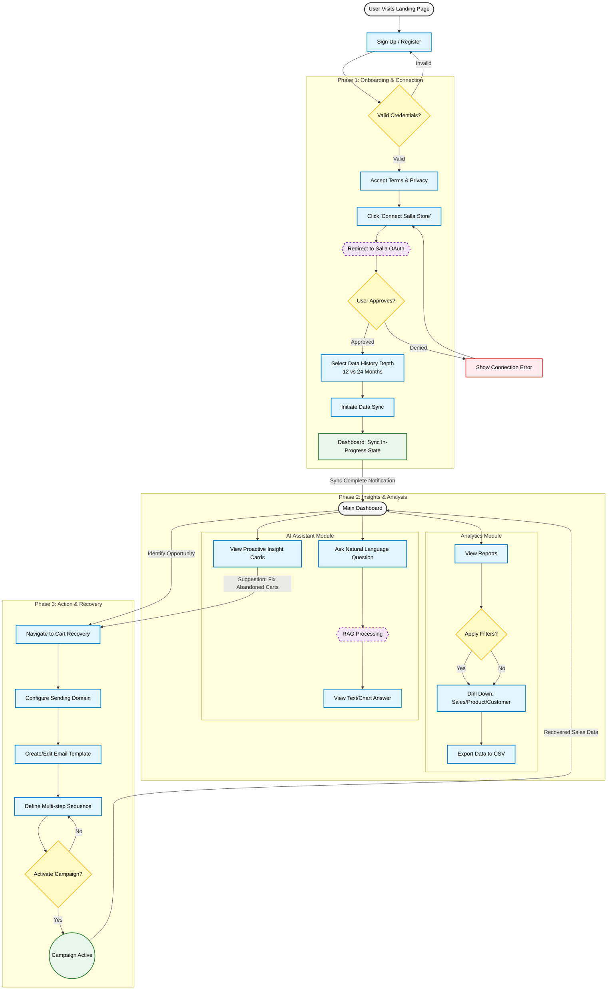

{
  "diagram_info": {
    "diagram_name": "SaaS Platform Merchant User Journey",
    "diagram_type": "flowchart",
    "purpose": "To visualize the complete end-to-end workflow of a Merchant user within the SaaS platform, encompassing onboarding, data analysis, AI interaction, and cart recovery automation.",
    "target_audience": [
      "Product Managers",
      "UX Designers",
      "Frontend Developers",
      "QA Engineers"
    ],
    "complexity_level": "medium",
    "estimated_review_time": "5 minutes"
  },
  "diagram_elements": {
    "actors_systems": [
      "Merchant User",
      "SaaS Platform",
      "Salla Platform",
      "Shopper (Indirect)"
    ],
    "key_processes": [
      "Registration",
      "OAuth Connection",
      "Data Synchronization",
      "Analytics Exploration",
      "Cart Recovery Setup"
    ],
    "decision_points": [
      "Connect Salla Store?",
      "Select Sync Depth",
      "Interact with AI or Reports?",
      "Configure Recovery Campaign?"
    ],
    "success_paths": [
      "Complete Onboarding -> Dashboard -> Insights -> Action"
    ],
    "error_scenarios": [
      "Salla Connection Denied",
      "Sync Failure"
    ],
    "edge_cases_covered": [
      "Waiting for Sync",
      "No Data Available"
    ]
  },
  "accessibility_considerations": {
    "alt_text": "Flowchart depicting the merchant's journey from sign-up to managing cart recovery campaigns, including onboarding steps and analytical interactions.",
    "color_independence": "Shapes and text labels distinguish process steps from decisions and outcomes",
    "screen_reader_friendly": "Flow is structured logically top-to-bottom",
    "print_compatibility": "High contrast borders and text"
  },
  "technical_specifications": {
    "mermaid_version": "10.0+",
    "responsive_behavior": "Vertical layout optimized for scrolling",
    "theme_compatibility": "Neutral colors suitable for light and dark modes",
    "performance_notes": "Standard node count, fast rendering"
  },
  "usage_guidelines": {
    "when_to_reference": "During UX design reviews, onboarding flow implementation, and integration testing planning.",
    "stakeholder_value": {
      "developers": "Understanding the dependencies between onboarding and feature availability",
      "designers": "Mapping UI states for empty, loading, and active data views",
      "product_managers": "Validating the user value loop from insight to action",
      "qa_engineers": "Defining end-to-end test scenarios"
    },
    "maintenance_notes": "Update if new modules (e.g., Inventory Management) are added to the user journey.",
    "integration_recommendations": "Include in the Onboarding Epic documentation."
  },
  "validation_checklist": [
    "✅ Registration and Auth flow included",
    "✅ Critical Salla OAuth step mapped",
    "✅ Data Sync wait states represented",
    "✅ Core feature usage (Analytics, AI, Recovery) shown",
    "✅ Loop closing (Actions leading to results) visualized",
    "✅ Error handling for initial connection included",
    "✅ Mermaid syntax validated"
  ]
}

---

# Mermaid Diagram

